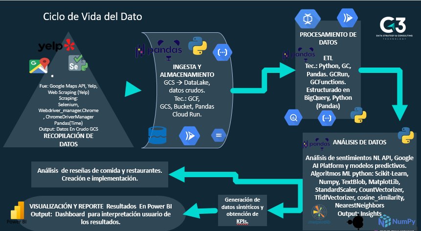

# **Proyecto Final Data Science**

# Análisis del Mercado Gastronómico en California para Máquinas de Impresión 3D de Alimentos

## Descripción General

Este proyecto tiene como objetivo principal analizar las oportunidades de mercado para la implementación de máquinas de impresión de alimentos en el sector gastronómico de California. Las máquinas de impresión 3D de alimentos, desarrolladas por la empresa que nos ha contratado, ofrecen una solución innovadora para restaurantes que buscan diversificar su menú con opciones personalizadas y atender las crecientes necesidades dietéticas de sus clientes, tales como vegetarianos, veganos, o personas con restricciones alimentarias. 

Además, estas máquinas permiten reducir los tiempos de entrega, mejorar la eficiencia operativa y superar los retos logísticos relacionados con la producción y entrega de alimentos frescos en ubicaciones geográficamente dispersas. Este análisis busca identificar patrones y áreas donde la implementación de esta tecnología puede ofrecer un impacto positivo.

## Objetivos del Proyecto

El proyecto tiene como principales objetivos:

- **Identificar áreas de oportunidad** en restaurantes de California, utilizando análisis de reseñas de clientes para detectar insatisfacción en cuanto a opciones alimenticias limitadas.
- **Determinar las ubicaciones geográficas** donde las quejas sobre la falta de opciones alimentarias son más comunes.
- **Proponer soluciones basadas en la implementación** de máquinas de impresión 3D de alimentos para mejorar la oferta gastronómica de los restaurantes y su capacidad de respuesta.
- **Optimizar la logística y la velocidad de despacho** al reducir el tiempo de preparación de los alimentos y mejorar la producción local, minimizando costos y tiempos de envío.
- **Ofrecer soluciones automatizadas** para suplir la falta de personal calificado en la preparación de platos específicos y personalizados.

## Alcance del Proyecto

Nuestro análisis se centra en:
- **Recopilación de reseñas de clientes** de restaurantes en las principales áreas de California, especialmente en zonas con alta densidad poblacional y turística.
- **Análisis semántico** para identificar menciones relacionadas con dietas especiales o insatisfacción por la falta de opciones alimentarias (por ejemplo, "opciones veganas limitadas", "sin gluten", "falta de variedad").
- **Estudio de viabilidad** para la introducción de las máquinas en áreas estratégicas, optimizando tanto la preparación de alimentos como la logística de distribución.
- **Recomendación de restaurantes** o zonas que podrían beneficiarse más de esta tecnología, ayudándolos a aumentar su eficiencia y atracción de clientes.

## Conclusiones del Análisis Exploratorio de Datos (EDA)

Durante nuestro análisis de datos inicial, identificamos algunos puntos críticos:

- **Calidad de datos**: Encontramos un porcentaje significativo de valores faltantes en columnas como `description`, `price` y `hours`. Se recomienda imputar o eliminar estas entradas según su relevancia.
- **Duplicados**: Identificamos miles de registros duplicados que necesitan ser eliminados para garantizar la precisión del análisis.
- **Outliers**: Detectamos valores atípicos en campos como `time` y `longitude`, que requieren revisión para decidir si se tratan de errores o datos válidos.
- **Distribución geográfica**: La concentración de reseñas en determinadas regiones ofrece una oportunidad para realizar análisis detallados a nivel local.
  
A partir de este análisis, recomendamos un enfoque enfocado en la limpieza de datos y el análisis semántico para extraer patrones valiosos que guíen la toma de decisiones.

## Metodología de Trabajo

Utilizamos la metodología ágil **Scrum** para la gestión de este proyecto, organizando el trabajo en sprints de tres semanas con revisiones constantes para ajustar el enfoque según los hallazgos del análisis.

### Roles del equipo:

- **Data Engineers**: Encargados de la limpieza, procesamiento y almacenamiento de datos.
- **Machine Learning Engineers**: Desarrollo y optimización de modelos predictivos.
- **Data Analyst**: Análisis de tendencias y patrones en las reseñas de clientes.

### KPIs Clave:
- **Reseñas Analizadas**: Más de 100,000.
- **Patrones de Insatisfacción**: Al menos 25 identificados.
- **Precisión de los Modelos Predictivos**: Superior al 85%.
-  1. ROI
	medirlo por año y ver un incremento en 1. El primer año obtenr el total de lo invertido hasta recuperarlo 5 veces.
- 2. Aumentar la calificación promedio de reseñas en al menos un 0.01%, en un año tras la implementación hasta llegar a 0.08 de incremento
 - 3. VAN

	  •	Temporalidad: Evaluación mensual o trimestral para monitorear el progreso de ventas.
	  •	Objetivo: Medir la adopción de las máquinas por parte de los restaurantes en California.
	  •	Meta: Alcanzar una tasa de penetración del 5% en el primer año y un 15% en los próximos tres años.

4. Alcanzar un ahorro de al menos un 20% en los costos logísticos dentro del primer año tras la impelmentación:
   Medición de la reducción en los costos de envío de alimentos específicos gracias a la impresión local, calculando el ahorro promedio por restaurante tras la implementación de las máquinas.
	Fórmula:
  ACL = Alcanzar 
	CA = costo logístico antes de implementación
	CD = costo logístico despues de implementación
	
$$
ACL = 100 \left( \frac{C_A - C_D}{C_A} \right)
$$

	 •	 Temporalidad: Medición semestral o anual para capturar la tendencia de ahorro en costos.
	 •	 Objetivo: Cuantificar el impacto de la impresión local en la reducción de costos logísticos.    
    •  Meta: Alcanzar un ahorro de al menos un 20% en los costos logísticos dentro del primer año tras la implementación.

## Tecnologías Utilizadas

- Python
- Pandas
- Scikit-learn
- Herramientas de NLP (Procesamiento de Lenguaje Natural)
- Google Cloud Platform (GCP) para el almacenamiento de datos
- Tableau / Power BI para la visualización de resultados

## Flujo de Vida de los Datos

---

** Equipo de trabajo:
- Data Engineers: Evelyn Perez (https://github.com/eveper13) y D' Jesus Blanco (https://github.com/Djesus1987).
- Data Analyst: Bruno Peretti (https://github.com/Brunomperetti).
- MLOps: Gabriel Coria (https://github.com/funkydluffy) y  Alain Medel Mejía (https://github.com/PhDSchrodinger).

Este proyecto tiene como objetivo aprovechar la tecnología de impresión 3D para optimizar procesos en el sector gastronómico, permitiendo a los restaurantes adaptarse a las nuevas demandas del mercado, mejorar la eficiencia operativa y reducir costos. ¡Síguenos para más actualizaciones!
